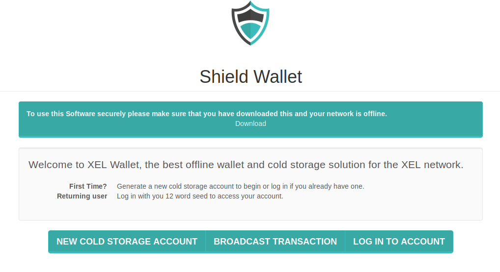

 

# Shield - cold storage

* OFFLINE creation of accounts for cold storage. With SHIELD, the passphrase to your brain wallet is NEVER exposed to anyone on the internet .

* Essentially, sending XEL and using Smart Transactions on the XEL Platform is 100% safe, as all can be signed OFFLINE. You can send XEL, send public or encrypted messages .

# Software Futurity

* Account Creation
* Login to Cold Storage Account
* Send Xel
* Signing 
* Broadcast Transaction
* Token Generation

# Shield - cold storage Screenshot

 

